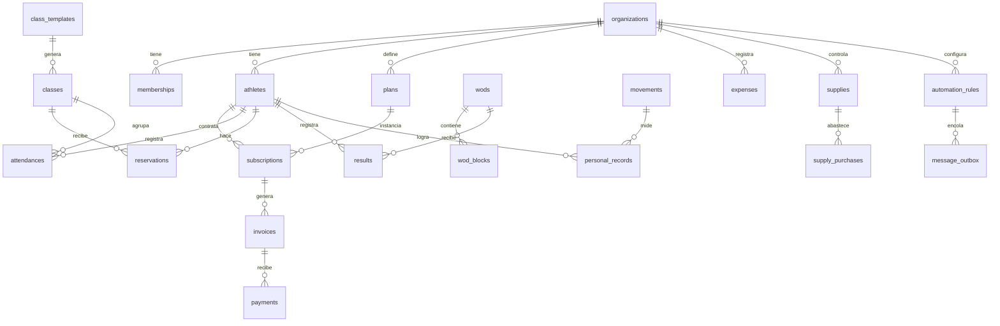

# 03 — Modelo de datos

Postgres 15 sobre Supabase. Convenciones:

- Claves primarias `uuid` con `gen_random_uuid()`.
- `org_id uuid not null` en **toda** tabla de negocio, con índice `(org_id, …)`.
- Dinero en **`bigint` de centavos de COP** (`amount_cents`), nunca `float`. Un peso
  colombiano no tiene centavos en la práctica, pero `bigint` evita para siempre los errores
  de redondeo y permite manejar otra moneda después.
- Fechas con hora en `timestamptz`; fechas calendario (corte, vencimiento) en `date`.
- `created_at`, `updated_at`, y `deleted_at` para borrado lógico donde importa el historial.
- Nombres de tabla en plural, en inglés (consistente con el código actual).

## Mapa de relaciones



## Núcleo multi-tenant

```sql
create table organizations (
  id            uuid primary key default gen_random_uuid(),
  slug          text unique not null,          -- box-rubio → box-rubio.scalar.app
  name          text not null,
  legal_name    text,
  tax_id        text,                          -- NIT
  timezone      text not null default 'America/Bogota',
  currency      char(3) not null default 'COP',
  logo_url      text,
  brand_color   text default '#EF4444',
  phone         text,
  address       text,
  city          text,
  -- estado de la cuenta de Scalar (no del box con sus atletas)
  plan_tier     text not null default 'trial', -- trial | starter | box | pro
  status        text not null default 'trial', -- trial | active | past_due | suspended | churned
  trial_ends_at date,
  onboarded_at  timestamptz,
  settings      jsonb not null default '{}',   -- preferencias, banderas de funcionalidad
  created_at    timestamptz not null default now(),
  updated_at    timestamptz not null default now()
);

create table memberships (
  id           uuid primary key default gen_random_uuid(),
  org_id       uuid not null references organizations(id) on delete cascade,
  user_id      uuid not null references auth.users(id) on delete cascade,
  role         text not null check (role in ('owner','admin','coach','athlete')),
  permissions  jsonb not null default '{}',    -- {"can_view_finances": true}
  athlete_id   uuid,                           -- si role='athlete', apunta a athletes.id
  status       text not null default 'active', -- active | invited | disabled
  invited_at   timestamptz,
  accepted_at  timestamptz,
  created_at   timestamptz not null default now(),
  unique (org_id, user_id)
);
create index on memberships (user_id);
create index on memberships (org_id, role);
```

### RLS: el patrón base

```sql
-- Helper: los boxes a los que pertenece el usuario actual.
create or replace function auth_org_ids()
returns setof uuid language sql stable security definer set search_path = '' as $$
  select org_id from public.memberships
  where user_id = auth.uid() and status = 'active'
$$;

create or replace function has_role(target_org uuid, roles text[])
returns boolean language sql stable security definer set search_path = '' as $$
  select exists (
    select 1 from public.memberships
    where user_id = auth.uid() and org_id = target_org
      and status = 'active' and role = any(roles)
  )
$$;

-- Se aplica a TODAS las tablas:
alter table athletes enable row level security;

create policy "staff lee atletas de su box" on athletes for select
  using (org_id in (select auth_org_ids()) and has_role(org_id, array['owner','admin','coach']));

create policy "staff modifica atletas de su box" on athletes for all
  using (org_id in (select auth_org_ids()) and has_role(org_id, array['owner','admin','coach']))
  with check (org_id in (select auth_org_ids()));

create policy "el atleta se lee a si mismo" on athletes for select
  using (id = (select athlete_id from memberships
               where user_id = auth.uid() and org_id = athletes.org_id));
```

> Las tablas financieras (`invoices`, `payments`, `expenses`, `supply_purchases`) **no
> conceden `select` al rol `coach`** salvo que `permissions->>'can_view_finances' = 'true'`.

## Personas

```sql
create table athletes (
  id               uuid primary key default gen_random_uuid(),
  org_id           uuid not null references organizations(id) on delete cascade,
  first_name       text not null,
  last_name        text,
  document_id      text,                    -- cédula, opcional
  birth_date       date,
  gender           text,
  phone            text,                    -- E.164: +573001234567. Clave para WhatsApp
  email            text,
  avatar_url       text,
  emergency_contact_name  text,
  emergency_contact_phone text,
  -- comercial
  referral_source  text,                    -- Instagram | Referido | Google | Pasó por el frente
  referred_by_athlete_id uuid references athletes(id),
  joined_at        date not null default current_date,
  status           text not null default 'active',  -- lead | trial | active | frozen | overdue | churned
  churned_at       date,
  churn_reason     text,
  -- salud (DATO SENSIBLE — requiere autorización explícita, ver docs/07)
  injuries         text,
  medical_notes    text,
  -- operación
  coach_notes      text,                    -- privado del staff, nunca visible al atleta
  tags             text[] default '{}',
  consent_whatsapp_at timestamptz,          -- evidencia del opt-in
  consent_data_at     timestamptz,
  created_at       timestamptz not null default now(),
  updated_at       timestamptz not null default now(),
  deleted_at       timestamptz
);
create index on athletes (org_id, status);
create index on athletes (org_id, phone);
```

> **Migración desde el prototipo**: el `access_code` desaparece (se reemplaza por OTP
> real). Los campos `back_squat`, `karen`, etc. dejan de ser columnas y pasan a
> `personal_records`, que es donde debían estar desde el principio.

## Membresías y dinero

```sql
create table plans (
  id              uuid primary key default gen_random_uuid(),
  org_id          uuid not null references organizations(id) on delete cascade,
  name            text not null,              -- "Mensualidad ilimitada", "8 clases"
  description     text,
  price_cents     bigint not null,
  billing_period  text not null default 'monthly', -- monthly | quarterly | semiannual | annual | one_off
  duration_days   int,                        -- para bonos
  class_quota     int,                        -- null = ilimitado
  is_active       boolean not null default true,
  created_at      timestamptz not null default now()
);

create table subscriptions (
  id               uuid primary key default gen_random_uuid(),
  org_id           uuid not null references organizations(id) on delete cascade,
  athlete_id       uuid not null references athletes(id) on delete cascade,
  plan_id          uuid not null references plans(id),
  price_cents      bigint not null,           -- se congela: si sube el plan, el atleta viejo mantiene precio
  discount_cents   bigint not null default 0,
  discount_reason  text,
  started_on       date not null,
  ends_on          date,                      -- null = indefinida
  billing_day      int not null check (billing_day between 1 and 31),  -- la "fecha de corte"
  status           text not null default 'active', -- active | paused | overdue | cancelled
  paused_from      date,
  paused_until     date,                      -- congelamiento por viaje o lesión
  cancel_reason    text,
  created_at       timestamptz not null default now()
);
create index on subscriptions (org_id, status, billing_day);

create table invoices (
  id             uuid primary key default gen_random_uuid(),
  org_id         uuid not null references organizations(id) on delete cascade,
  athlete_id     uuid not null references athletes(id) on delete cascade,
  subscription_id uuid references subscriptions(id),
  number         text not null,               -- consecutivo interno por box
  period_start   date not null,
  period_end     date not null,
  issued_on      date not null default current_date,
  due_on         date not null,
  amount_cents   bigint not null,
  paid_cents     bigint not null default 0,
  status         text not null default 'open', -- open | paid | partial | overdue | void
  notes          text,
  created_at     timestamptz not null default now(),
  unique (org_id, number)
);
create index on invoices (org_id, status, due_on);

create table payments (
  id            uuid primary key default gen_random_uuid(),
  org_id        uuid not null references organizations(id) on delete cascade,
  invoice_id    uuid references invoices(id),
  athlete_id    uuid not null references athletes(id),
  amount_cents  bigint not null,
  method        text not null,                -- cash | transfer | nequi | daviplata | card | pse | other
  paid_at       timestamptz not null default now(),
  reference     text,                         -- número de transacción
  receipt_url   text,                         -- foto del comprobante en Storage
  provider      text,                         -- wompi | mercadopago | manual
  provider_ref  text,
  recorded_by   uuid references auth.users(id),
  status        text not null default 'confirmed', -- pending | confirmed | rejected | refunded
  created_at    timestamptz not null default now()
);
create index on payments (org_id, paid_at desc);
```

Regla de negocio central: `generate-invoices` corre a diario y, para cada suscripción
`active` cuyo `billing_day` cae hoy (ajustando meses cortos: día 31 en febrero → último
día), crea la factura del periodo siguiente con `due_on = hoy + grace_days` (configurable
por box, por defecto 3). **Con restricción única sobre
`(subscription_id, period_start)` para que correr el job dos veces no duplique el cobro.**

## Entrenamiento

```sql
create table movements (                        -- catálogo, global + propios del box
  id            uuid primary key default gen_random_uuid(),
  org_id        uuid references organizations(id) on delete cascade, -- null = catálogo global
  name          text not null,                -- "Back Squat", "Snatch"
  category      text,                         -- weightlifting | gymnastics | monostructural
  metric        text not null,                -- weight | time | reps | rounds_reps | distance | calories
  is_benchmark  boolean not null default false, -- Fran, Karen, Murph
  unique (coalesce(org_id::text,'global'), name)
);

create table personal_records (
  id            uuid primary key default gen_random_uuid(),
  org_id        uuid not null references organizations(id) on delete cascade,
  athlete_id    uuid not null references athletes(id) on delete cascade,
  movement_id   uuid not null references movements(id),
  value_numeric numeric not null,             -- 120 (kg) o 510 (segundos) — SIEMPRE numérico
  unit          text not null,                -- kg | lb | sec | reps | m | cal
  reps          int default 1,                -- 1RM, 3RM, 5RM
  achieved_on   date not null default current_date,
  source        text not null default 'manual', -- manual | wod_result | import
  result_id     uuid,
  notes         text,
  created_at    timestamptz not null default now()
);
create index on personal_records (org_id, athlete_id, movement_id, achieved_on desc);
```

> Esto reemplaza `athlete_progress` del prototipo, que guardaba `field_name text` +
> `value text`. Al ser numérico y estar contra un catálogo, se puede graficar, ordenar,
> comparar contra el promedio del box y detectar el PR automáticamente.

```sql
create table wods (
  id            uuid primary key default gen_random_uuid(),
  org_id        uuid not null references organizations(id) on delete cascade,
  date          date not null,
  title         text,
  notes         text,                         -- notas del coach para el día
  published_at  timestamptz,                  -- si es null, el atleta no lo ve todavía
  created_by    uuid references auth.users(id),
  created_at    timestamptz not null default now(),
  unique (org_id, date, coalesce(title,''))
);

create table wod_blocks (
  id          uuid primary key default gen_random_uuid(),
  org_id      uuid not null references organizations(id) on delete cascade,
  wod_id      uuid not null references wods(id) on delete cascade,
  position    int not null,
  kind        text not null,                  -- warmup | strength | metcon | accessory | cooldown
  title       text,
  description text not null,                  -- texto libre: "21-15-9 Thrusters 43kg / Pull-ups"
  score_type  text,                           -- for_time | amrap | emom | load | not_scored
  time_cap_sec int,
  scaling     jsonb default '{}'              -- {"rx": "...", "scaled": "...", "beginner": "..."}
);

create table results (
  id            uuid primary key default gen_random_uuid(),
  org_id        uuid not null references organizations(id) on delete cascade,
  wod_block_id  uuid not null references wod_blocks(id) on delete cascade,
  athlete_id    uuid not null references athletes(id) on delete cascade,
  value_numeric numeric,                      -- segundos, rondas.reps, kg
  display_value text,                         -- "8:42", "5+13"
  scale         text default 'rx',            -- rx | scaled | beginner
  notes         text,
  rpe           int check (rpe between 1 and 10),
  energy        int check (energy between 1 and 5),
  logged_by     text default 'athlete',       -- athlete | coach
  created_at    timestamptz not null default now(),
  unique (wod_block_id, athlete_id)
);

-- Horarios y reservas (v1, fase F2.5)

create table class_templates (                  -- la parrilla semanal: "Lunes 6:00 am, cupo 14"
  id           uuid primary key default gen_random_uuid(),
  org_id       uuid not null references organizations(id) on delete cascade,
  name         text not null default 'CrossFit',
  weekday      int not null check (weekday between 0 and 6),
  start_time   time not null,
  duration_min int not null default 60,
  capacity     int not null,
  coach_id     uuid references auth.users(id),
  valid_from   date not null default current_date,
  valid_until  date,
  is_active    boolean not null default true
);

create table classes (                          -- instancias concretas, generadas desde la plantilla
  id             uuid primary key default gen_random_uuid(),
  org_id         uuid not null references organizations(id) on delete cascade,
  template_id    uuid references class_templates(id),
  name           text not null default 'CrossFit',
  starts_at      timestamptz not null,
  ends_at        timestamptz not null,
  capacity       int not null,
  reserved_count int not null default 0,        -- desnormalizado, mantenido por trigger
  coach_id       uuid references auth.users(id),
  wod_id         uuid references wods(id),
  status         text not null default 'scheduled', -- scheduled | cancelled
  cancel_reason  text,                          -- festivo, cierre, coach enfermo
  created_at     timestamptz not null default now(),
  unique (org_id, template_id, starts_at)
);
create index on classes (org_id, starts_at);

create table reservations (
  id            uuid primary key default gen_random_uuid(),
  org_id        uuid not null references organizations(id) on delete cascade,
  class_id      uuid not null references classes(id) on delete cascade,
  athlete_id    uuid not null references athletes(id) on delete cascade,
  status        text not null default 'booked', -- booked | waitlisted | attended | no_show | cancelled
  waitlist_pos  int,
  booked_at     timestamptz not null default now(),
  cancelled_at  timestamptz,
  checked_in_at timestamptz,
  consumed_credit boolean not null default false, -- descuenta del bono de clases
  unique (class_id, athlete_id)
);
create index on reservations (org_id, athlete_id, booked_at desc);
create index on reservations (class_id, status);

create table attendances (
  id          uuid primary key default gen_random_uuid(),
  org_id      uuid not null references organizations(id) on delete cascade,
  athlete_id  uuid not null references athletes(id) on delete cascade,
  class_id    uuid references classes(id),
  date        date not null default current_date,
  status      text not null default 'attended', -- reserved | attended | no_show | cancelled
  checked_in_at timestamptz default now(),
  unique (org_id, athlete_id, date, coalesce(class_id::text,''))
);
create index on attendances (org_id, date desc);
create index on attendances (org_id, athlete_id, date desc);
```

### Reglas de reserva (las que hay que acertar)

Este módulo parece simple y no lo es. Las reglas que producen reclamos si están mal:

1. **Concurrencia del último cupo.** Dos atletas reservando el mismo cupo al tiempo. Se
   resuelve en la base, no en el cliente: la reserva se hace dentro de una función
   `book_class()` con `select … for update` sobre la clase. Nunca leyendo el cupo y
   escribiendo después.
2. **Quién puede reservar.** Membresía `active` (no vencida ni congelada), con cupo de
   clases disponible si el plan es por bonos. **El box decide si un atleta en mora puede
   reservar**: es la palanca de cobro más efectiva que existe, y es configurable.
3. **Ventanas de tiempo**, todas por box: con cuánta antelación se abre la reserva
   (ej. 48 h), hasta cuándo se puede reservar (ej. 30 min antes), y hasta cuándo se puede
   cancelar sin penalización (ej. 2 h antes).
4. **Lista de espera automática.** Al cancelar alguien, el primero de la lista pasa a
   reservado y **recibe el aviso por WhatsApp** sin que nadie haga nada. Esta es
   exactamente la clase de detalle que hace que un box cambie de software.
5. **No-show.** Reservó y no llegó. Política configurable: solo registrar, avisar, o
   bloquear la reserva por N días tras M faltas. Y **el no-show consume o no el bono de
   clases**, según lo defina el box.
6. **Cancelación de una clase entera** (festivo, coach enfermo): avisa a todos los
   reservados y devuelve los créditos consumidos.
7. **Generación de instancias**: un job semanal crea las `classes` de las próximas 2–4
   semanas desde `class_templates`, respetando el calendario de festivos colombianos.
8. **La asistencia sale de la reserva.** `reservations.status = 'attended'` alimenta
   `attendances`; el check-in manual sigue existiendo para quien llega sin reservar (si el
   box lo permite).

## Logística y finanzas del box

```sql
create table expense_categories (
  id      uuid primary key default gen_random_uuid(),
  org_id  uuid not null references organizations(id) on delete cascade,
  name    text not null,                      -- Arriendo, Servicios, Coaches, Insumos, Equipos
  kind    text not null default 'operational' -- operational | payroll | capex | tax
);

create table suppliers (
  id      uuid primary key default gen_random_uuid(),
  org_id  uuid not null references organizations(id) on delete cascade,
  name    text not null,
  phone   text, email text, notes text
);

create table supplies (                         -- magnesio, tiza, cauchos, cintas
  id              uuid primary key default gen_random_uuid(),
  org_id          uuid not null references organizations(id) on delete cascade,
  name            text not null,
  unit            text not null default 'unidad', -- unidad | kg | caja
  current_stock   numeric not null default 0,
  min_stock       numeric not null default 0,   -- dispara la alerta de compra
  avg_unit_cost_cents bigint,
  default_supplier_id uuid references suppliers(id),
  reorder_every_days  int,                      -- compra recurrente estimada
  last_purchased_on   date,
  notes           text
);

create table supply_purchases (                 -- "cuándo compré magnesio y a cuánto"
  id            uuid primary key default gen_random_uuid(),
  org_id        uuid not null references organizations(id) on delete cascade,
  supply_id     uuid references supplies(id),
  supplier_id   uuid references suppliers(id),
  purchased_on  date not null default current_date,
  quantity      numeric not null,
  total_cents   bigint not null,
  invoice_url   text,                           -- foto de la factura
  notes         text,
  expense_id    uuid                            -- se refleja automáticamente como gasto
);

create table expenses (
  id            uuid primary key default gen_random_uuid(),
  org_id        uuid not null references organizations(id) on delete cascade,
  category_id   uuid references expense_categories(id),
  supplier_id   uuid references suppliers(id),
  description   text not null,
  amount_cents  bigint not null,
  incurred_on   date not null default current_date,
  paid_on       date,
  is_recurring  boolean not null default false,
  recurrence    text,                           -- monthly | annual
  next_due_on   date,                           -- alimenta el calendario de compromisos
  receipt_url   text,
  created_by    uuid references auth.users(id)
);
create index on expenses (org_id, incurred_on desc);
```

El P&L es una vista:

```sql
create view monthly_pnl as
select org_id,
       date_trunc('month', d)::date as month,
       sum(income_cents)  as income_cents,
       sum(expense_cents) as expense_cents,
       sum(income_cents) - sum(expense_cents) as net_cents
from ( … union all … ) x
group by 1,2;
```

## Automatizaciones y mensajería

```sql
create table message_templates (
  id          uuid primary key default gen_random_uuid(),
  org_id      uuid references organizations(id) on delete cascade, -- null = plantilla de fábrica
  key         text not null,                  -- payment_due_soon | payment_overdue | winback_14d
  channel     text not null default 'whatsapp', -- whatsapp | email | sms
  category    text not null default 'utility',  -- utility | marketing | authentication
  provider_template_name text,                -- nombre aprobado en Meta
  body        text not null,                  -- "Hola {{nombre}}, tu mensualidad vence el {{fecha}}"
  variables   text[] default '{}',
  is_active   boolean not null default true
);

create table automation_rules (
  id             uuid primary key default gen_random_uuid(),
  org_id         uuid not null references organizations(id) on delete cascade,
  key            text not null,               -- identifica la regla de fábrica
  name           text not null,
  trigger_type   text not null,               -- schedule | event
  trigger_config jsonb not null default '{}', -- {"days_before_due": 3} | {"event":"pr_achieved"}
  conditions     jsonb not null default '[]',
  action_type    text not null,               -- send_message | create_task | tag_athlete | notify_staff
  template_id    uuid references message_templates(id),
  is_active      boolean not null default true,
  quiet_hours    int4range default '[8,21)',  -- no escribir de madrugada
  max_per_athlete_per_month int default 4,    -- antifatiga
  last_run_at    timestamptz,
  created_at     timestamptz not null default now(),
  unique (org_id, key)
);

create table message_outbox (
  id             uuid primary key default gen_random_uuid(),
  org_id         uuid not null references organizations(id) on delete cascade,
  athlete_id     uuid references athletes(id) on delete cascade,
  rule_id        uuid references automation_rules(id),
  channel        text not null,
  to_address     text not null,               -- teléfono E.164 o correo
  template_key   text,
  rendered_body  text not null,
  status         text not null default 'queued', -- queued | sent | delivered | read | failed | cancelled
  scheduled_for  timestamptz not null default now(),
  sent_at        timestamptz,
  provider_msg_id text,
  error          text,
  attempts       int not null default 0,
  cost_micros    bigint,                      -- costo real reportado por el proveedor
  dedupe_key     text,                        -- evita reenviar lo mismo
  created_at     timestamptz not null default now(),
  unique (org_id, dedupe_key)
);
create index on message_outbox (status, scheduled_for);

create table athlete_risk_scores (
  org_id            uuid not null references organizations(id) on delete cascade,
  athlete_id        uuid not null references athletes(id) on delete cascade,
  computed_on       date not null default current_date,
  days_since_last_visit int,
  visits_last_30d   int,
  visits_prev_30d   int,
  days_overdue      int,
  score             int not null,             -- 0-100
  band              text not null,            -- ok | watch | at_risk | critical
  reasons           jsonb not null default '[]',
  primary key (org_id, athlete_id, computed_on)
);

create table audit_log (
  id          bigserial primary key,
  org_id      uuid,
  user_id     uuid,
  action      text not null,                  -- athlete.deleted, payment.created, member.impersonated
  entity      text, entity_id uuid,
  before      jsonb, after jsonb,
  ip          inet,
  created_at  timestamptz not null default now()
);

create table job_runs (
  id          bigserial primary key,
  job         text not null,
  started_at  timestamptz not null default now(),
  finished_at timestamptz,
  status      text,                           -- ok | error
  processed   int,
  error       text
);
```

## Plan de migración desde el prototipo

1. Crear el esquema nuevo en un proyecto limpio.
2. Crear la `organization` del box del entrenador.
3. `athletes`: copiar directo, partiendo `name` en nombre/apellido y normalizando el
   teléfono a E.164.
4. Las columnas de marcas (`back_squat`, `karen`, …) → filas en `personal_records`,
   mapeando cada columna a un `movement` y convirtiendo `"8:30"` a `510` segundos y
   `"120"` a `120` kg.
5. `athlete_progress` → `personal_records` con su `created_at` como `achieved_on`.
6. `workout_logs` → `results` (energía, RPE, notas) contra un `wod_block` genérico por día.
7. `payment_status` + `cut_day` → una `subscription` por atleta con `billing_day = cut_day`
   y, si estaba `pending`, una `invoice` abierta.
8. `access_code` **no se migra**: cada atleta recibe un enlace de activación.

Se escribe como script de migración con verificación de conteos, y se corre primero contra
una copia.
